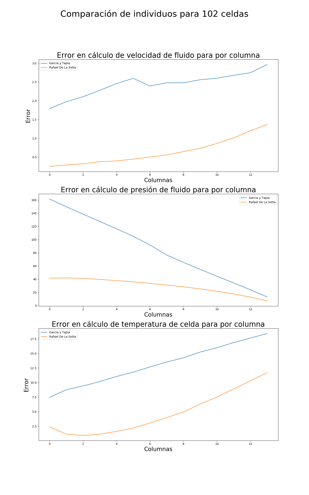

# **GE_RD_simple**

## **Instalation and run**

**Clone**

```bash
git clone https://github.com/rafadls/GE_RD_simple
cd GE_RD_simple
```

**Requirements**

```bash
pip install -r requirements.txt
```

**Variable**


To set the grid edit the "parameters/listaDeParametros.json" file
```json
{
"variableParams": 
    {
    "COEFICIENTE": [2], 
    "POPULATION_SIZE": [50,100],
    "GENERATIONS": [100],
    "CROSSOVER_PROBABILITY": [0.75],
    "MUTATION_PROBABILITY": [0.15],
    "optimizeConstant_each":[25,100],
    "MR": [false],
    "Correlation": [false],
    "check_minimum_fitness": [false], 
    "N_CELDAS": [53],
    "N_ROWS_TRAIN": [100],
    "N_ROWS_CORR": [100],
    "crossover_tries": [10],
    "mutation_tries": [10],
    "grad_calculations": [5],
    "grad_descendant": [20]
    }
}
```

**Run**

```bash
cd src/
python ponyge.py --variable
```

## **Output Examples**

### Train
To set the grid edit the "parameters/listaDeParametros.json" file
```json
{
"variableParams": 
    {
    "COEFICIENTE": [2], 
    "POPULATION_SIZE": [50,100],
    "GENERATIONS": [100],
    "CROSSOVER_PROBABILITY": [0.75],
    "MUTATION_PROBABILITY": [0.15],
    "optimizeConstant_each":[25,100],
    "MR": [false],
    "Correlation": [false],
    "check_minimum_fitness": [false], 
    "N_CELDAS": [53],
    "N_ROWS_TRAIN": [100],
    "N_ROWS_CORR": [100],
    "crossover_tries": [10],
    "mutation_tries": [10],
    "grad_calculations": [5],
    "grad_descendant": [20]
    }
}
```
The code train the different configurations and then compare them.

**Evolution comparison**


**Performance comparison**


### Compare individuals
To set the individuals to compare edit the "/datasets/Compare/individuals.csv" file

|Name              |cdrag                                                                                                                    |ffactor                                                                                   |nusselt                                   |
|------------------|-------------------------------------------------------------------------------------------------------------------------|------------------------------------------------------------------------------------------|------------------------------------------|
|Francisco Villa   |4.78*(0.636*(4.81*Rem^(2.3*0.49^An))^(Dfn^(An/Rem) ) ) ^ 0.0148                                                     |4 * ( 1.021 * (9*S)^(2.81*S)^(-2) + (0.3021/(S^2))^2 - 0.6) * Rem ^ (-0.2655)        |Rem^0.677                                |
|Garcia y Tapia    |0.891 * An - An^2 + Rem ** 0.1452                                                                                       |Dfn * S ^ (24.5261 * Rem ^(-0.3891)-2)                                                  |2.0232 * Rem^0.5528                      |
|Francisco Born    |0.8905 * An - 0.9997 * An ^ 2 + Rem ^ 0.1452                                                                           |Dfn ^ (2.5175 * Rem ^ (-0.1006)) * S ^ (22.7098 * Rem ^ (-0.3774) -2.0218)            |1.9324 * Rem ^ 0.5577 + 1                |
|Rafael De La Sotta|if_lower_else(Rem, 113.0, ((((colIndex  )  + 0)     / ((S  )  + (Dfn^8.7*fluidColumn^1.4*colIndex^0.9 ) )))*Rem , 1.5)|((((3.5 )*(Rem^-0.5*Dfn^-1.9*S^-2.7*colIndex  ) + (3.1 )*(Dfn^-3.5*S^-1.0 ))  / (1)))|(0.14)*(Rem^(0.7438))*(Prandtl^(0.7068))|

The code compare the individuals in the csv file by their fitness. 

**Direct Performance** 

Based on the error between the coefficient; Cgrad, ff, Nusselt


**Indirect Performance**

Based on the error between the model's output, velocity, pressure and temperature.  



**Physics Performance**

Based on the relation between the inputs and the outputs. This relatino is seen as courves.


